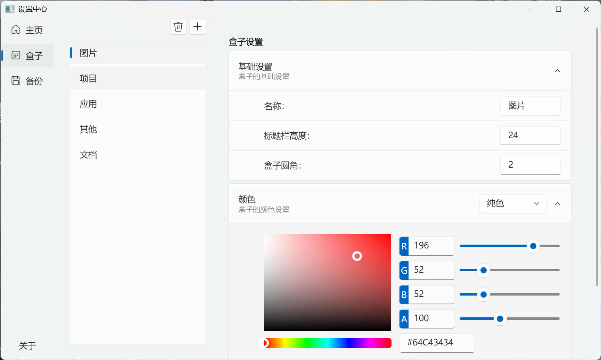

<div align="center">
  <a>
    
  </a>
  <h1>NewDesktop</h1>
  <p>
    这是一个基于WPF的Win桌面重写计划。
  </p>
  <p>
    是个桌面整理软件加美化软件，计划在最大限度保留原生体验的前提下加点东西。
  </p>
  
  <a >
    [English](./README-en.md) | [中文](../zh/README.md)
  </a>
<a href="../zh/README.md">
    [中文]
  </a>
<br />
  <a>
    
  </a>
  <a>
    
  </a>
</div>

# 预览
<div align="center">
    
    
</div>

# 操作
## 图标操作

1. 图标拖动：支持单个或多个图标同时拖动改变位置，支持将图标拖入系统文件管理器/网页文件拖入（由于还在施工，并有一些问题未解决，存在BUG是正常的。）。

2. 图标右键菜单：在图标上右键点击会调用原生Windows10上下文右键菜单（Windows11上下文右键菜单暂时弄不出来。）。

3. 图标双击/文件拖入：图标双击为操作。将文件拖放到图标上时，如果图标对应的是.exe或.lnk文件，会将拖放的文件作为参数传递给该可执行文件并启动；如果图标对应的是文件夹，那还没写。

## 盒子操作

1. 盒子右键菜单：在盒子的内容区域右键点击会弹出右键菜单，目前包含新建盒子、移除盒子、自动盒子、设置菜单操作。

2. 创建盒子：可在盒子的设置中创建新的盒子，或在盒子的右键菜单中选择“新建盒子”来创建新的盒子。

3. 拖动盒子：可以拖动盒子改变其位置，有边缘吸附功能。

4. 调整盒子大小：在盒子四周和四角拖动可以改变盒子的宽度和高度。按住 Ctrl 键时，尺寸调整将会对齐到基准单位。

折叠 / 展开盒子：双击盒子头部可以折叠或展开盒子。在盒子的右键菜单中选择 “自动盒子”后将根据鼠标悬停和离开盒子自动展开和收起。

# 文件结构
```
NewDesktop/
├── Behaviors/                                # 自定义交互行为
│   ├── ContextMenuBehavior.cs
│   ├── DoubleClickBehavior.cs                # 双击交互行为（打开/选择操作）
│   ├── DragBehavior.cs                       # 拖放功能实现（支持Canvas内元素拖拽和边缘吸附）
│   └── IconDragDrop.cs
├── Models/                                   # 数据模型
│   ├── Box.cs                                # 盒子模型
│   ├── Icon.cs                               # 图标模型
│   └── PositionedObject.cs                   # 基类
├── Services/                                 # 服务层
│   └── SaveLoadService.cs                    # 保存加载
├── Shell/                                    # 系统集成模块
│   ├── ContextMenu.cs                        # 调用原生Windows Shell右键菜单（文件/文件夹）
│   └── DesktopAttacher.cs                    # 窗口桌面附着器（将应用嵌入桌面层）
├── Styles/                                   # 样式资源
│   ├── Dictionary.xaml                       # 全局资源字典（滚动条样式）
│   └── ListViewStyle.xaml                    # ListView样式
├── ViewModels/                               # 视图模型
│   ├── BoxModel.cs                           # 盒子视图模型
│   ├── IconModel.cs                          # 图标视图模型
│   └── MainViewModel.cs                      # 主视图模型
├── Views/                                    # 视图层
│   ├── Common/                               # 通用控件库
│   │   └── ColorPickerUserControl.xaml.cs    # 颜色选择器控件
│   ├── BoxView.xaml                          # 盒子控件
│   │   └── BoxView.xaml.cs                   # 盒子控件后台逻辑
│   ├── IconView.xaml                         # 图标控件
│   │   └── IconView.xaml.cs                  # 图标控件后台逻辑
│   └── SettingsPage/                         # 设置功能控件视图
│       ├── BoxSettingsPage.xaml              # 盒子属性设置页
│       │   └── BoxSettingsPage.xaml.cs
│       ├── HomeSettingsPage.xaml             # 主界面设置页
│       │   └── HomeSettingsPage.xaml.cs
│       ├── ss.xaml                           # [待命名] 临时设置页
│       │   └── ss.xaml.cs
│       └── SaveSettingsPage.xaml             # 布局保存规则设置页
│           └── SaveSettingsPage.xaml.cs
├── App.xaml                                  # 应用入口
│   └── App.xaml.cs
├── MainWindow.xaml                           # 主窗口（承载桌面画布）
│   └── MainWindow.xaml.cs                    # 窗口扩展逻辑
└── SettingsWindow.xaml                       # 独立设置窗口
    └── SettingsWindow.xaml.cs                # 设置窗口逻辑（导航框架管理）
```
